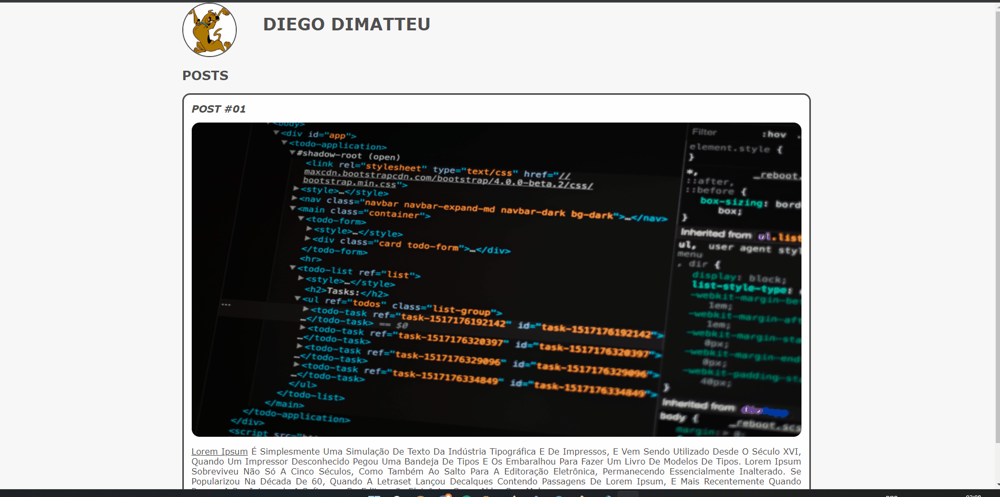

# Introdução a criação de websites com HTML5 e CSS3

### Professor: Lucas Vilaboim
- [DIO](https://web.dio.me/course/introducao-criacao-de-websites-com-html5-e-css3/learning/462f831d-5fdf-485e-bf07-1d391eb94ac8?back=/track/tqi-fullstack-developer&tab=undefined&moduleId=undefined)

Aqui está os exemplos das aulas realizadas durante o módulo em questão.

