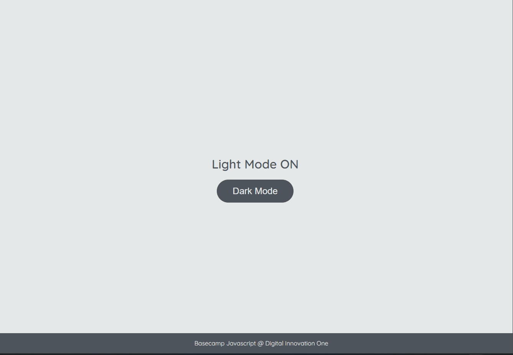

# Atividades em JavaScript: DOM

### Instrutora: Stephany Nusch [GitHub](https://github.com/stebsnusch)

```txt
ATIVIDADE LIGHT MODE/DARK MODE

PROSPOSTA:

1 - Crie uma estrutura básica de projeto front-end (HTML, CSS e JS);
2 - Copie o HTML e o CSS deste repositório;
3 - Crie um arquivo chamado scripts.js na sua pasta assets/js;
4 - Selecione os elementos: h1, button, footer e body;
5 - Se os elementos possuirem a classe dark-mode, modifique seus estilos. Caso contrário, volte os estilos para o original.
```
### Resultado do projeto

